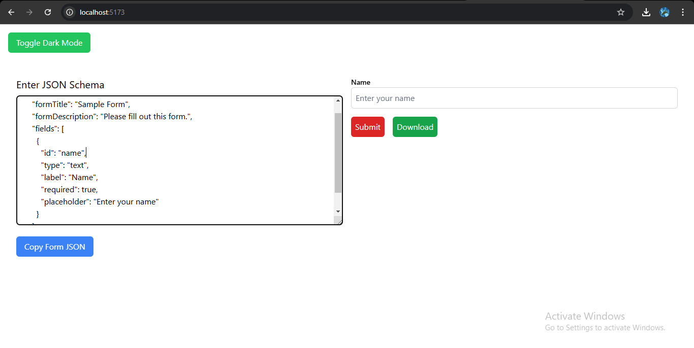

 # React + TypeScript + Vite

 Dynamic Form Generator

This project is a dynamic form generator built using **React**, **TypeScript**, and **Tailwind CSS**. The application takes a JSON schema as input and dynamically generates a styled, functional form in real-time. The interface includes a split-screen design with a JSON editor on one side and a real-time form preview on the other.

🚀 Features
Main Interface
Split-Screen Design
  Left Side: JSON editor with syntax highlighting, real-time validation, and error messages for invalid JSON.
  Right Side: Form preview that updates dynamically as the JSON schema is edited.
Mobile-Responsive Layout**:
 On smaller screens, the editor and form preview stack vertically for better usability.

 Form Features
- Supports all standard field types defined in the JSON schema.
- Displays proper validation messages for required fields, invalid inputs, and pattern mismatches.
- Includes loading states where appropriate.
- Allows form submission with `console.log()` and displays a success message upon completion.
- Styled consistently using **Tailwind CSS**.

Testing
- Comprehensive testing using **Playwright** (E2E testing) and **Jest** (unit testing):
  - Validates JSON schema functionality.
  - Tests real-time form generation and updates.
  - Ensures form validation and submission correctness.
  - Verifies responsiveness and error handling for edge cases.

---

🛠️ Technical Stack

Frontend Framework**: React 18+
Language: TypeScript for type safety and robust development.
Styling: Tailwind CSS for consistent and responsive design.
Form Handling: React Hook Form for efficient form validation and state management.
JSON Editor: Monaco Editor for a rich editing experience.
Testing Tools: Jest and Playwright for comprehensive test coverage.

---


 Setup Instructions

1. Clone the Repository:
   ```bash
   git clone https://github.com/ManjunathKandkoor/dynamic-form-generator.git
   cd dynamic-form-generator
   ```

2.Install Dependencies:
   ```bash
   npm install
   ```

3. Run the Development Server:
   ```bash
   npm run dev
   ```
   Open the app at `http://localhost:5173` in your browser.

4. Example JSON Schema:

   {
     "formTitle": "Sample Form",
     "formDescription": "Please fill out this form.",
     "fields": [
       {
         "id": "name",
         "type": "text",
         "label": "Name",
         "required": true,
         "placeholder": "Enter your name"
       }
     ]
   }
   

{

  "formTitle": "Project Requirements Survey",

  "formDescription": "Please fill out this survey about your project needs",

  "fields": [

    {

      "id": "name",

      "type": "text",

      "label": "Full Name",

      "required": true,

      "placeholder": "Enter your full name"

    },

    {

      "id": "email",

      "type": "email",

      "label": "Email Address",

      "required": true,

      "placeholder": "you@example.com",

      "validation": {

        "pattern": "^[^\\s@]+@[^\\s@]+\\.[^\\s@]+$",

        "message": "Please enter a valid email address"

      }

    },

    {

      "id": "companySize",

      "type": "select",

      "label": "Company Size",

      "required": true,

      "options": [

        { "value": "1-50", "label": "1-50 employees" },

        { "value": "51-200", "label": "51-200 employees" },

        { "value": "201-1000", "label": "201-1000 employees" },

        { "value": "1000+", "label": "1000+ employees" }

      ]

    },

    {

      "id": "industry",

      "type": "radio",

      "label": "Industry",

      "required": true,

      "options": [

        { "value": "tech", "label": "Technology" },

        { "value": "healthcare", "label": "Healthcare" },

        { "value": "finance", "label": "Finance" },

        { "value": "retail", "label": "Retail" },

        { "value": "other", "label": "Other" }

      ]

    },

    {

      "id": "timeline",

      "type": "select",

      "label": "Project Timeline",

      "required": true,

      "options": [

        { "value": "immediate", "label": "Immediate (within 1 month)" },

        { "value": "short", "label": "Short-term (1-3 months)" },

        { "value": "medium", "label": "Medium-term (3-6 months)" },

        { "value": "long", "label": "Long-term (6+ months)" }

      ]

    },

    {

      "id": "comments",

      "type": "textarea",

      "label": "Additional Comments",

      "required": false,

      "placeholder": "Any other details you'd like to share..."

    }

  ]

}


 Testing Instructions

1. Run Unit Tests:
   ```bash
   npm run test
   ```

2. Run E2E Tests:
   ```bash
   npx playwright test
   ```


Output of the Project:



This screenshot shows the main interface of the Dynamic Form Generator. On the left, users can edit the JSON schema, and on the right, they see the real-time preview of the form.

1. Download Button:
Purpose: Allows the user to download the current JSON schema (representing the form displayed on the right side of the screen) as a .json file.

2. Submit Button: 
Purpose: Submits the data from the form preview generated based on the JSON schema

3.Copy Form JSON Button:
 Purpose: Copies the JSON content from the editor to the clipboard.

4.Toggle Dark Mode Button:
Purpose: Switches the interface between light and dark themes.

